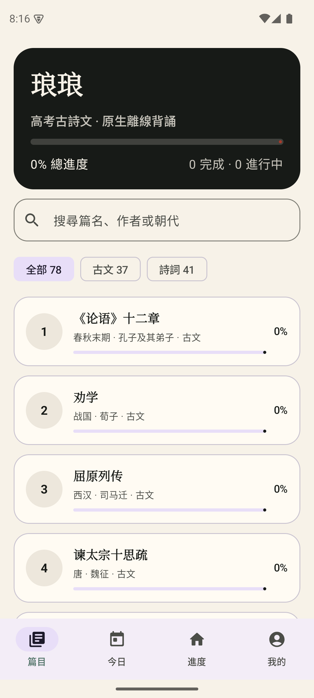
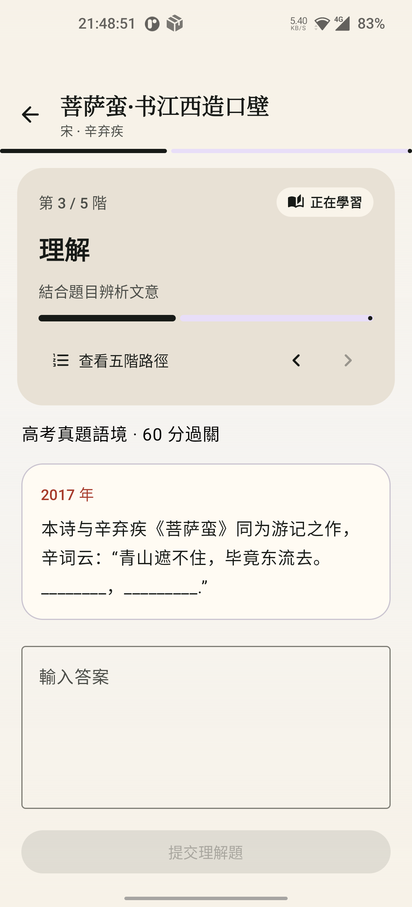
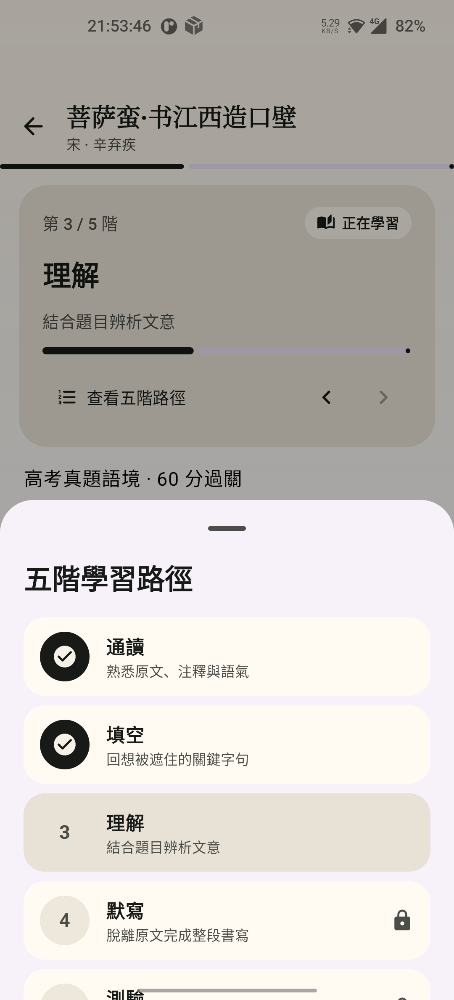
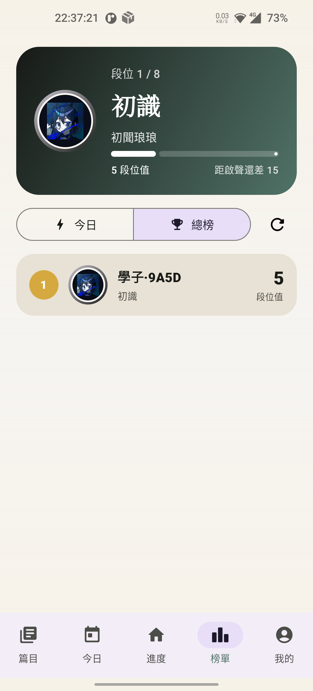
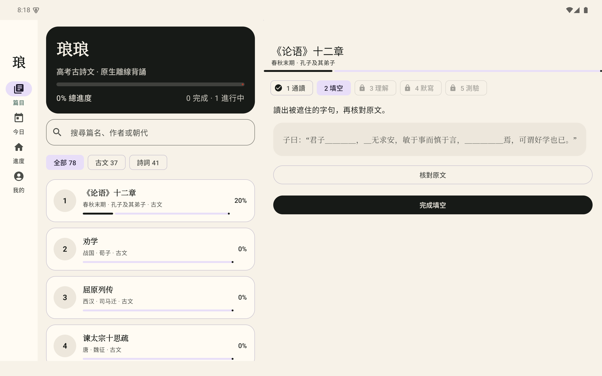

# 琅琅 Android

`recite.bdfz.net` 的原生 Android 客户端。不是 WebView 壳，也不是网页端改版。

## 当前能力

- Kotlin + Jetpack Compose 原生界面
- 78 篇高考古诗文随 APK 打包，断网可读
- 通读、填空、理解、默写、测验五阶段离线学习
- 当前阶段主卡 + 纵向五阶路径，完成、当前与锁定状态清晰分离
- Room 本地进度库与幂等同步 outbox
- WorkManager 在网络恢复后同步至 BDFZ User Center
- Seiue 或既有 BDFZ 用户名登录；首次 Seiue 登录自动建立 User Center 帐号
- 原创八段位成长体系；升至殿堂、巅峰后自动切换金色与紫青头像框
- 原生今日榜与总榜；服务端从已同步进度计算段位值，客户端不能自报分数
- App 内原生反馈，服务端保存后通过既有 Telegram 路由通知维护者
- 用户进度、学习记录与反馈统一进入 `my.bdfz.net`；站点与 App 后端统一进入 `pulse.bdfz.net`
- 手机底部导航；平板导航栏与篇目/练习双栏
- R2 直装版内置受校验更新；Play 版不申请侧载权限

## 界面

| 手机目录 | 五阶核心 |
|---|---|
|  |  |

| 纵向五阶路径 | 原生排行榜 |
|---|---|
|  |  |

| 平板双栏 |
|---|
|  |

## 技术栈

- Android Gradle Plugin 9.2.1
- Gradle 9.6.1
- JDK 17
- Kotlin 2.3.10（AGP 内建 Kotlin）
- Jetpack Compose BOM 2026.06.00
- compileSdk / targetSdk 37，minSdk 23
- Room 2.8.4、WorkManager 2.11.2、OkHttp 5.4.0
- 排行服务：Cloudflare Workers + D1，Wrangler 4.115.0、TypeScript 7.0.2

## 本地构建

```bash
export ANDROID_USER_HOME=/private/tmp/recite-android-home
export GRADLE_USER_HOME=/private/tmp/recite-gradle-home
./gradlew :app:testDirectDebugUnitTest :app:assembleDirectDebug
```

直装调试 APK：

```text
app/build/outputs/apk/direct/debug/app-direct-debug.apk
```

发布构建优先读取以下环境变量，值不得写入仓库：

```text
RECITE_ANDROID_KEYSTORE_PATH
RECITE_ANDROID_KEYSTORE_PASSWORD
RECITE_ANDROID_KEY_ALIAS
RECITE_ANDROID_KEY_PASSWORD
```

未配置专用变量时，构建会使用现有 `BDFZ_ANDROID_KEYSTORE_*` 组织签名变量。

```bash
./gradlew :app:assembleDirectRelease :app:bundlePlayRelease
```

## 两个发行通道

| 通道 | applicationId | 更新方式 |
|---|---|---|
| R2 直装 | `net.bdfz.recite.direct` | `img.bdfz.net` 第一方清单 + 内容寻址 APK |
| Google Play | `net.bdfz.recite.direct` | Play 商店；无 `REQUEST_INSTALL_PACKAGES` |

两个通道使用同一 package 与 app-signing identity，因此 Android 只保留一个
琅琅 App，Direct 与 Play 都只能覆盖更新。Play Console 建档时必须把现有
App 签名密钥交给 Play App Signing；不能让 Google 另建不兼容的 App 签名。
通道差异只保留在更新方式与侧载权限。

当前公开版本：[`v0.1.3`](https://github.com/ieduer/recite-android/releases/tag/v0.1.3)。直装 APK 也可从 [第一方 R2 地址](https://img.bdfz.net/apps/recite-android/releases/v0.1.3/94d4ac0c02c5/langlang-0.1.3.apk) 获取；安装前可用 [`latest.json`](https://img.bdfz.net/apps/recite-android/latest.json) 核对版本与 SHA-256。

## 文档

- [Cloudflare 后端分析](docs/CLOUDFLARE_ARCHITECTURE.md)
- [验证标准](docs/VERIFICATION.md)
- [发布与回滚](docs/RELEASE.md)
- [隐私说明](docs/PRIVACY.md)

代码采用 MIT License。`app/src/main/assets` 内的语料与试题不自动适用 MIT，权利归原始权利人。
